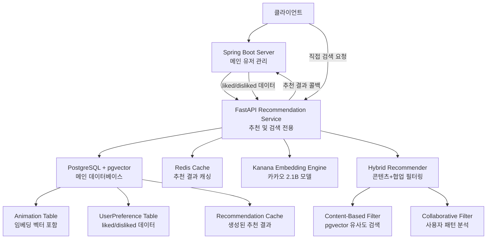

# 애니메이션 AI 추천 시스템

임베딩 기반 애니메이션 추천 시스템입니다. 유저의 시청 이력을 기반으로 취향을 분석하고, 콘텐츠 기반 필터링과 협업 필터링을 결합한 하이브리드 추천 알고리즘을 제공합니다.

## 🚀 주요 기능

- **🎯 개인화된 추천**: 유저 시청 이력 기반 맞춤형 추천
- **🧠 하이브리드 알고리즘**: 콘텐츠 기반 + 협업 필터링 결합
- **📊 취향 분석**: 장르, 태그, 연도 등 상세한 취향 프로필 생성
- **🔥 트렌딩 추천**: 최신 인기 애니메이션 추천
- **⚡ 고성능 API**: FastAPI 기반 RESTful API 제공
- **📚 자동 문서화**: Swagger UI 및 ReDoc 지원
- **🆕 배치 추천 시스템**: 대량 사용자 추천 배치 처리
- **🔴 Redis 캐싱**: 추천 결과 고속 캐싱
- **🔄 백그라운드 작업**: 비동기 추천 생성 및 Spring 서버 연동
- **📈 상세 분석**: 장르 유사성, 선호도 점수, 추천 이유 제공

## 🛠️ 기술 스택

- **Backend**: Python 3.8+
- **Database**: PostgreSQL + pgvector (메인 DB)
- **ML/AI**: scikit-learn, numpy, pandas
- **API Framework**: FastAPI
- **임베딩**: 카카오 Kanana 2.1B 모델 (온디맨드 로딩)
- **Fallback 임베딩**: TF-IDF + SVD
- **딥러닝**: PyTorch, Transformers (Hugging Face)
- **유사도 계산**: pgvector Cosine Similarity (고속 검색)
- **캐싱**: Redis + PostgreSQL 임베딩 캐시
- **백그라운드 작업**: FastAPI BackgroundTasks + Scheduled Jobs
- **외부 연동**: HTTP Requests (Spring Server)

## 📦 설치 및 실행

### 1. 시스템 요구사항
- **PostgreSQL 14+** (pgvector 확장 지원)
- **Redis 6+** (캐싱용)
- **Python 3.8+**

### 2. PostgreSQL + pgvector 설치
```bash
# Ubuntu/Debian
sudo apt update
sudo apt install postgresql postgresql-contrib
sudo apt install postgresql-14-pgvector

# 또는 Docker 사용
docker run --name postgres-pgvector \
  -e POSTGRES_PASSWORD=your_password \
  -p 5432:5432 \
  -d pgvector/pgvector:pg14
```

### 3. 의존성 설치
```bash
pip install -r requirements.txt
```

### 4. 환경 설정
```bash
# .env 파일 생성 (.env.example 참고)
cp .env.example .env

# 데이터베이스 설정 수정
DB_HOST=localhost
DB_NAME=anime_recommendation_db
DB_USERNAME=postgres
DB_PASSWORD=your_password
```

### 5. 데이터베이스 초기화
```bash
# 데이터베이스 및 테이블 생성
python database.py

# 샘플 데이터 생성 (선택사항)
python models.py
```

### 6. API 서버 실행
```bash
python api_server.py
```

서버가 시작되면 다음 URL에서 확인할 수 있습니다:
- API 서버: http://localhost:8000
- API 문서: http://localhost:8000/docs
- ReDoc: http://localhost:8000/redoc

### 7. Spring 서버와 연동
```bash
# Spring 서버에서 애니메이션 데이터 동기화
curl -X POST "http://localhost:8000/api/internal/sync/animations" \
  -H "Authorization: Bearer YOUR_API_KEY"

# 유저 취향 데이터는 매일 12시 자동 동기화됨
```

## 🔧 API 사용법

### 🎯 메인 추천 API (Spring 연동)

#### 1. 개인화 추천 받기
```bash
curl -X POST "http://localhost:8000/api/recommend" \
  -H "Content-Type: application/json" \
  -d '{
    "user_id": "user123",
    "liked_anime_ids": [129, 102, 116],
    "disliked_anime_ids": [88, 201],
    "n_recommendations": 10
  }'
```

#### 2. 의미론적 검색 (pgvector 기반)
```bash
curl -X POST "http://localhost:8000/api/search/semantic" \
  -H "Content-Type: application/json" \
  -d '{
    "query": "액션과 우정이 있는 애니메이션",
    "limit": 10
  }'
```

#### 3. 텍스트 검색
```bash
curl "http://localhost:8000/api/search?q=스파이 패밀리&limit=5"
```

#### 4. 트렌딩 애니메이션
```bash
curl "http://localhost:8000/api/trending?year_start=2020&year_end=2025&limit=10"
```

### 🔄 Spring 서버 연동 API

#### 5. 애니메이션 데이터 동기화 (Spring → FastAPI)
```bash
curl -X POST "http://localhost:8000/api/internal/animations/sync" \
  -H "Authorization: Bearer YOUR_API_KEY" \
  -H "Content-Type: application/json" \
  -d '{
    "type": "new_animations",
    "animation_ids": [12345, 12346, 12347]
  }'
```

#### 6. 사용자 취향 업데이트 (Spring → FastAPI)
```bash
curl -X POST "http://localhost:8000/api/internal/users/sync" \
  -H "Authorization: Bearer YOUR_API_KEY" \
  -H "Content-Type: application/json" \
  -d '{
    "user_preferences": [
      {
        "user_id": "user123",
        "liked_anime_ids": [1, 2, 3],
        "disliked_anime_ids": [4, 5]
      }
    ]
  }'
```

### 📊 모니터링 & 관리 API

#### 7. 동기화 상태 확인
```bash
curl "http://localhost:8000/api/internal/sync/status"
```

#### 8. 임베딩 벡터 상태 확인
```bash
curl "http://localhost:8000/api/internal/embeddings/stats"
```

#### 9. 데이터베이스 헬스체크
```bash
curl "http://localhost:8000/health"
```

### 🆕 향상된 추천 응답 형식

이제 모든 추천 API는 다음과 같은 상세 정보를 포함합니다:

```json
{
  "id": 12345,
  "title": "나 혼자만 레벨업",
  "final_score": 0.85,
  "content_score": 0.45,
  "collab_score": 0.40,
  "genre_similarity": 0.78,
  "preference_score": 4.2,
  "anime_genres": ["액션", "판타지", "드라마"],
  "user_top_genres": ["액션", "판타지", "SF"],
  "matched_genres": ["액션", "판타지"],
  "recommendation_reason": "'액션', '판타지' 장르를 선호하시는 취향과 일치 • 좋은 선호도 예상 (★★★★☆) • 종합 분석을 통한 최적 매칭",
  "recommendation_method": "hybrid",
  "genres": "액션|판타지|드라마",
  "year": 2024,
  "synopsis": "인류 최약체 병기로 불리던 성진우가 각성하여..."
}
```

#### 필드 설명:
- **genre_similarity**: 0-1 범위의 장르 유사성 점수
- **preference_score**: 1-5 범위의 예상 선호도 점수
- **anime_genres**: 해당 애니메이션의 장르 목록
- **user_top_genres**: 사용자 상위 선호 장르 (최대 5개)
- **matched_genres**: 일치하는 장르들
- **recommendation_reason**: 추천 이유 설명 (최대 3개 요소)
- **recommendation_method**: 추천 방법 (content/collaborative/hybrid)

## 📊 추천 알고리즘

### 1. 콘텐츠 기반 필터링 (Kanana 임베딩)
- **카카오 Kanana 2.1B 모델**: 한국어에 최적화된 고성능 임베딩
- **의미론적 임베딩**: 제목, 장르, 태그, 줄거리를 768차원 Dense Vector로 변환
- **문맥 이해**: Transformer 기반으로 텍스트의 의미와 맥락 파악
- **Fallback TF-IDF**: Kanana 불가시 TF-IDF + SVD 사용
- **코사인 유사도**: 고차원 벡터 공간에서의 정밀한 유사도 계산

#### 🧠 Kanana 유사성 계산 원리
**텍스트 결합 예시:**
```
나루토: "나루토 NARUTO ナルト 액션|어드벤처|드라마 닌자|우정|성장|전투 마을의 천덕꾸러기였던 나루토가..."
원피스: "원피스 ONE PIECE ワンピース 액션|어드벤처|드라마 해적|우정|모험|전투 고무고무 열매를 먹고..."
```

**Kanana가 계산하는 유사성:**
- **장르/태그 매칭**: "액션", "어드벤처", "우정" 등 공통 요소
- **플롯 구조**: "주인공의 성장 스토리" 패턴 인식
- **테마적 유사성**: "동료와의 우정", "꿈을 향한 여정" 등
- **스토리 톤**: "전투/모험" 분위기와 캐릭터 관계

**실제 계산 결과:**
- 원피스 ↔ 나루토: **0.75~0.85** (높은 유사성)
- 원피스 ↔ 러브코미디: **0.2~0.4** (낮은 유사성)
- 같은 장르라도 스토리 구조가 다르면 점수 차이 발생

### 2. 협업 필터링
- **아이템 기반**: 유사한 애니메이션을 본 사용자들의 패턴 분석
- **유사도 매트릭스**: 애니메이션 간 관계 분석

### 3. 하이브리드 추천 (🆕 개선됨)
- **가중치 결합**: 콘텐츠 기반(60%) + 협업 필터링(40%)
- **점수 정규화**: 두 방법의 점수를 정규화하여 결합
- **다양성 보너스**: 하이브리드 매칭시 10% 보너스 점수
- **장르 균형**: 다양한 장르 추천을 위한 다양성 필터
- **최종 랭킹**: 통합 점수로 최종 추천 목록 생성

### 4. 🆕 상세 분석 기능
- **장르 유사성**: 사용자 선호 장르와 애니메이션 장르 간 매칭 점수
- **종합 선호도**: 장르, 태그, 년도를 종합한 예상 선호도 점수 (1-5점)
- **매칭 장르**: 사용자가 선호하는 장르 중 해당 애니메이션과 일치하는 장르들
- **추천 이유**: 왜 이 애니메이션이 추천되었는지에 대한 설명
- **추천 방법**: content/collaborative/hybrid 방법 구분

#### 🎯 핵심 추천 점수 3가지
**API 응답에서 제공하는 핵심 점수:**

1. **genre_score (장르 점수)**
   - 사용자가 좋아하는 장르와 애니메이션 장르의 매칭도
   - 예: 액션 좋아하는 유저 + 원피스(액션/어드벤처) = 0.9

2. **story_score (스토리 점수) - 🔥 가장 중요!**
   - **Kanana가 계산한 스토리/테마 유사성**
   - 단순 장르 매칭이 아닌 플롯, 분위기, 캐릭터 관계 등 종합 분석
   - 원피스 ↔ 나루토처럼 비슷한 성장 스토리는 높은 점수

3. **preference_score (취향 점수)**
   - 장르 + 태그 + 년도 선호도를 종합한 개인화 점수
   - 1-5점 범위로 "이 유저가 이 애니를 얼마나 좋아할지" 예측

**이 3개 점수로 완벽한 추천 근거 제공!** ✨

## 🏗️ 시스템 아키텍처

### 전체 구조 (Spring 연동 아키텍처)


### 🔄 서비스 역할 분담

#### Spring Boot Server (메인 서버)
- **사용자 관리**: 회원가입, 로그인, 프로필 관리
- **평점 관리**: 사용자의 애니메이션 좋아요/싫어요 데이터
- **비즈니스 로직**: 메인 애플리케이션 로직 및 UI
- **데이터 동기화**: 사용자 선호도 변경시 추천 서비스에 업데이트 요청

#### FastAPI Recommendation Service (추천 서비스)
- **추천 생성**: 하이브리드 알고리즘 기반 개인화 추천
- **검색 기능**: 의미론적 검색 및 텍스트 검색
- **임베딩 처리**:
  - **기존 데이터**: 사전 계산된 임베딩 벡터 사용 (DB 저장)
  - **신규 데이터**: Spring 플래그 신호시에만 Kanana 모델 로딩하여 임베딩
  - **스케줄 업데이트**: 매일 12시 자동 임베딩 업데이트 (Spring 트리거)
- **성능 최적화**: pgvector를 활용한 고속 유사도 검색

### 핵심 컴포넌트

#### 1. **추천 엔진 (`AnimeRecommendationSystem`)**
- **데이터 로딩**: CSV 파일에서 애니메이션 메타데이터 로드
- **특성 추출**: Kanana 임베딩으로 콘텐츠 벡터화
- **유저 프로파일링**: liked/disliked 기반 취향 분석
- **하이브리드 추천**: 콘텐츠+협업 필터링 결합

#### 2. **임베딩 엔진 (`KananaEmbeddingModel`)**
- **Primary**: 카카오 Kanana 2.1B 모델 (768차원)
- **Fallback**: TF-IDF + SVD (768차원)
- **GPU 가속**: CUDA 지원으로 고속 처리
- **배치 처리**: 메모리 효율적 임베딩 생성

#### 3. **API 서버 (`FastAPI`)**
- **통합 추천 API**: `/api/recommend` (메인)
- **Legacy APIs**: 기존 호환성 유지
- **배치 처리**: 대량 사용자 추천 백그라운드 작업
- **Redis 캐싱**: 추천 결과 고속 저장/조회

#### 4. **사용자 프로파일 시스템**
- **입력**: `liked_anime_ids` + `disliked_anime_ids`
- **변환**: liked=4.5점, disliked=1.5점으로 내부 변환
- **분석**: 장르/태그 선호도, 시청 패턴 추출
- **저장**: 메모리 및 Redis 캐시

### 📈 데이터 플로우

#### 추천 생성 과정 (pgvector 기반)
```
1. User Request → 2. PostgreSQL 프로필 조회 → 3. 하이브리드 알고리즘
                                               ↓
4. 콘텐츠 기반 필터 ←→ 5. 협업 필터링
   (pgvector 유사도 검색)    (사용자 패턴 분석)
                                               ↓
6. 점수 결합 → 7. 다양성 필터 → 8. 최종 랭킹 → 9. Redis 캐싱
```

#### Spring 연동 플로우
```
🔄 일일 업데이트 (매일 12시)
Spring Server → 사용자 취향 데이터 → FastAPI → PostgreSQL 업데이트

⚡ 실시간 플래그 (신규 애니메이션)
Spring Server → 플래그 신호 → FastAPI → Kanana 임베딩 → PostgreSQL 저장

📊 추천 요청
클라이언트 → Spring Server → FastAPI → pgvector 검색 → 추천 결과 반환
```

#### 임베딩 관리 전략
```
✅ 기존 애니메이션: 사전 계산된 벡터 (DB 저장)
🆕 신규 애니메이션: Spring 플래그 → 온디맨드 Kanana 로딩 → 임베딩 생성
🔄 정기 업데이트: 매일 12시 사용자 취향 분석 및 프로필 벡터 갱신
⚡ 실시간 검색: pgvector 코사인 유사도로 고속 검색
```

### 성능 최적화

- **임베딩 캐싱**: 계산된 벡터 메모리 저장
- **유사도 매트릭스**: 사전 계산된 애니메이션 간 유사도
- **배치 처리**: 여러 텍스트 동시 임베딩
- **Redis 캐싱**: 추천 결과 24시간 캐시
- **GPU 가속**: Kanana 모델 CUDA 활용

## 📈 성능 특징

- **데이터 규모**: 4,417개 애니메이션 처리
- **임베딩 차원**: Kanana 768차원 / TF-IDF 5,000차원 → SVD 768차원
- **한국어 최적화**: Kanana 모델로 한국어 애니메이션 제목/설명 정확 처리
- **GPU 가속**: CUDA 지원으로 빠른 임베딩 생성 (선택사항)
- **실시간 추천**: 사용자 요청시 즉시 추천 생성
- **배치 처리**: 메모리 효율적인 배치 임베딩
- **확장성**: 새로운 애니메이션 및 사용자 데이터 쉽게 추가

## 🗂️ 프로젝트 구조

```
Anime-Data/
├── anime_recommender.py    # 핵심 추천 엔진
├── api_server.py          # FastAPI 서버
├── demo.py               # 데모 스크립트
├── requirements.txt      # 의존성 목록
├── README.md            # 프로젝트 문서
└── anilife_data_20250915_214030.csv  # 애니메이션 데이터
```

## 📋 데이터 구조

CSV 파일에는 다음과 같은 컬럼들이 포함되어 있습니다:

- `id`: 애니메이션 고유 ID
- `title_korean`, `title_japanese`, `title_english`: 다국어 제목
- `genres`: 장르 정보 (파이프(|) 구분)
- `tags`: 태그 정보 (파이프(|) 구분)
- `synopsis`: 줄거리
- `year`: 제작 연도
- `director`: 감독
- `studio`: 제작사

## 🔍 추천 시스템 특징

### 개인화 요소
- **장르 선호도**: 사용자가 시청한 애니메이션의 장르 분석
- **태그 선호도**: 세부적인 태그 기반 취향 파악
- **평점 가중치**: 사용자 평점을 고려한 선호도 계산
- **시간대 선호**: 선호하는 제작 연도대 분석

### 추천 다양성
- **다중 알고리즘**: 콘텐츠 기반 + 협업 필터링
- **트렌드 반영**: 최신 애니메이션 트렌드 고려
- **필터 옵션**: 연도, 장르별 필터링 지원

## 🚧 향후 개선 계획

- [ ] **딥러닝 모델**: Transformer 기반 임베딩 적용
- [ ] **사용자 행동**: 클릭, 시청 시간 등 암시적 피드백 활용
- [ ] **실시간 학습**: 새로운 사용자 데이터로 모델 업데이트
- [ ] **A/B 테스트**: 추천 알고리즘 성능 비교 및 최적화
- [ ] **소셜 기능**: 친구 추천, 커뮤니티 기반 추천

## 📞 문의 및 기여

이 프로젝트에 대한 문의사항이나 개선 제안이 있으시면 언제든지 연락해 주세요!

## 📝 개발 로그

### 2025-01-21: 시스템 통합 및 개선

#### 🔧 주요 변경사항
1. **추천 시스템 하이브리드 통일**
   - 모든 추천 API를 하이브리드 방식으로 통합
   - 새로운 메인 API: `POST /api/recommend`
   - Legacy API들은 호환성 유지하며 하이브리드로 리다이렉트

2. **사용자 피드백 시스템 개선**
   - `liked/disliked` 기반으로 평점 시스템 개선
   - liked → 4.5점, disliked → 1.5점으로 내부 변환
   - 기본 평점을 5.0 → 3.0으로 조정 (중간값)

3. **API 구조 개선**
   ```
   📍 메인 API (권장)
   POST /api/recommend                    # 통합 하이브리드 추천

   📍 Legacy APIs (호환성 유지)
   POST /api/recommend/content            # → 하이브리드로 리다이렉트
   POST /api/recommend/collaborative      # → 하이브리드로 리다이렉트
   POST /api/recommend/hybrid            # → 가중치 설정 가능

   📍 프로필 생성
   POST /api/user/profile                # 기존 방식 (legacy)
   POST /api/user/profile-ratings        # 평점 기반 (legacy)
   ```

#### 🎯 개선 효과
- **일관성 향상**: 모든 추천이 동일한 하이브리드 알고리즘 사용
- **사용성 개선**: 단일 통합 API로 복잡성 감소
- **호환성 유지**: 기존 클라이언트 코드 변경 없이 업그레이드 가능
- **백엔드 연동**: liked/disliked 데이터를 백엔드에서 직접 전달

#### 🚀 다음 단계
- [ ] liked/disliked 전용 API 구현
- [ ] 평점 기반 API 제거 고려
- [ ] 배치 추천 시스템 Spring 연동 테스트
- [ ] 성능 모니터링 및 최적화

---
**Made with ❤️ for Anime Lovers**